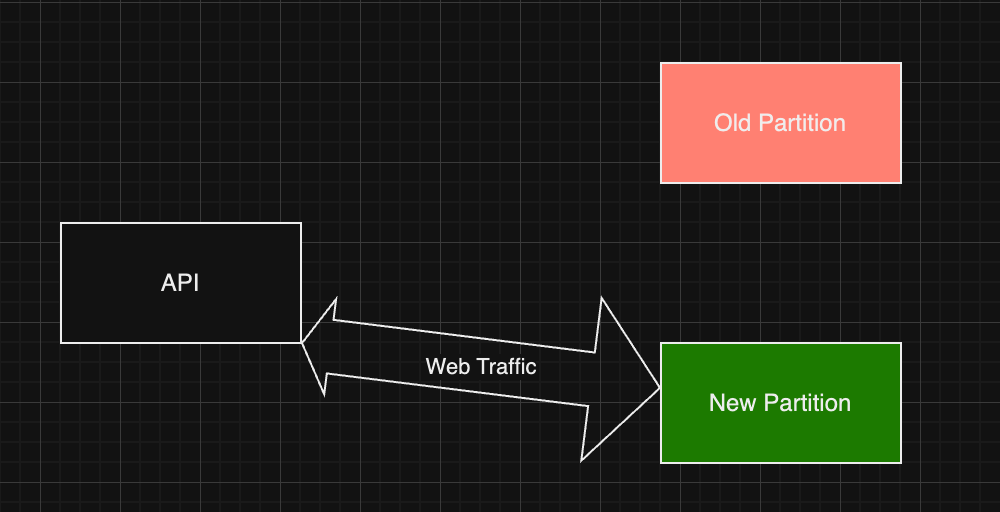
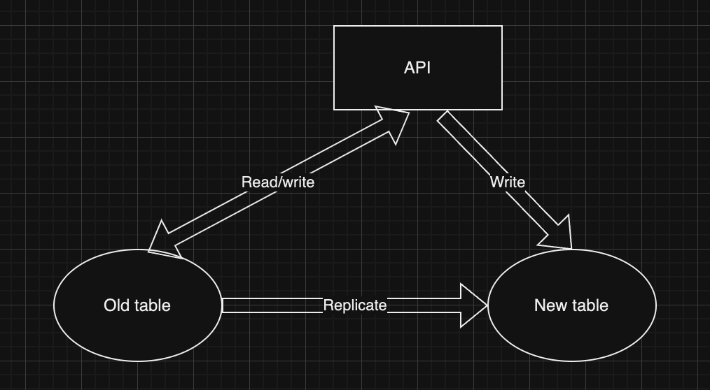
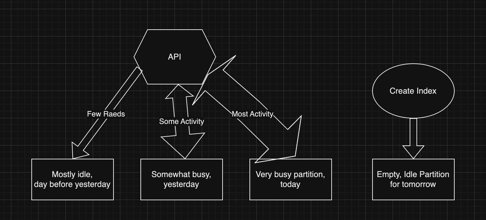
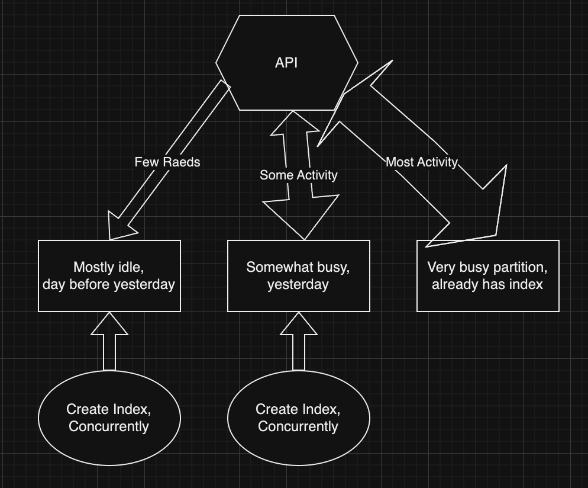
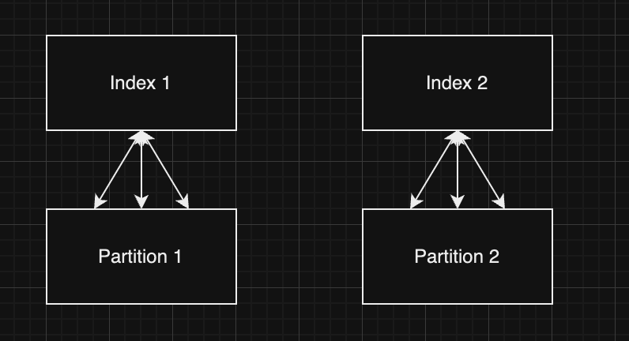
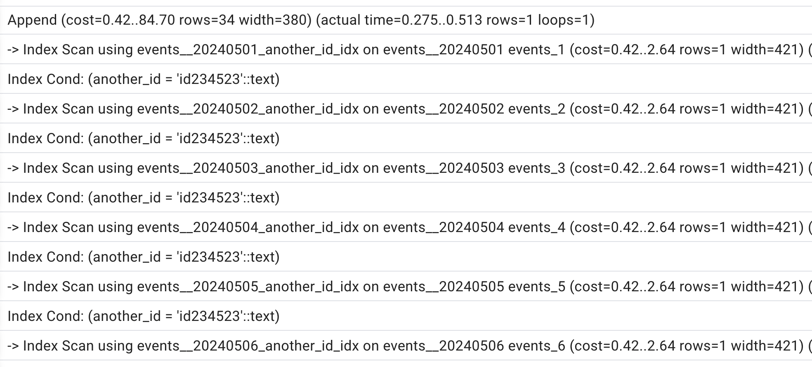
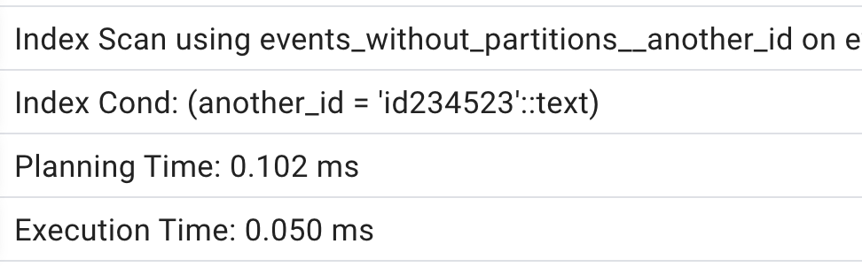
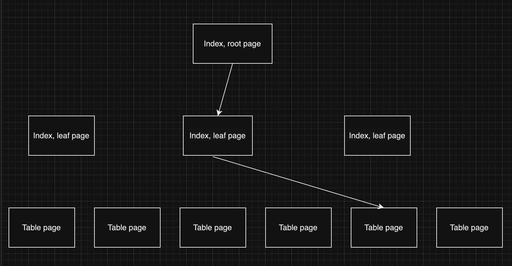
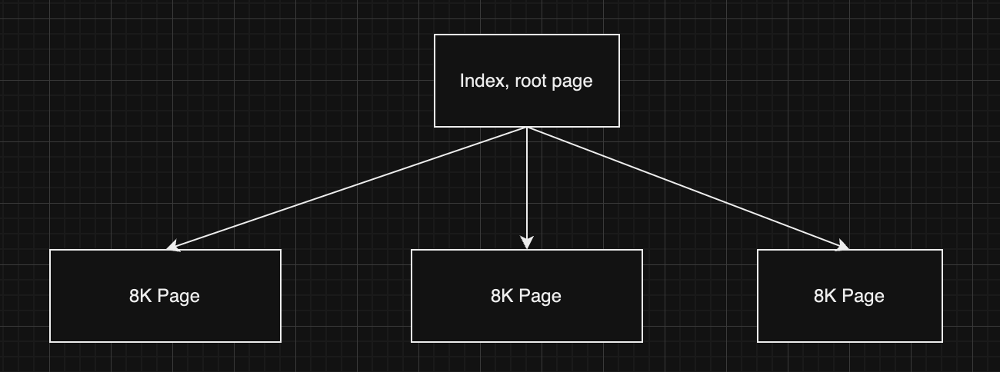

## Using Partitioned Tables in Highly Avaiable Systems: Lessons Learned
### TL/DR: Partitioned Tables are highly useful in some cases, not the best fit in other ones.
#### Pros
* No VACUUM overhead after dropping a partition
* Large data loads done without much impact on server's performance
* Can add an index on large partitioned table without much downtime
#### Cons
* Some queries are slower
* More difficult to ensure uniqueness
* More difficult to implement `UPSERT` aka `INSERT ... ON CONFLICT(...) DO UPDATE`
### Pro: No VACUUM Overhead After Dropping A Partition
This is the main reason we are using partitions. Dropping a partition does not add any work for `VACUUM`. We've had databases that were written to and read from 24/7, but at leat 90% of the resources were spent on deleting old data. So switching to partitions rendered those databases from very busy to mostly idle.
### Pro: Large Data Loads Done Without Much Impact on Server's Performance
Sometimes we need to upload large amounts of new data, mostly replacing existing rows. For data consistency, the switching for old version to new must happen at once. Without partitions, such loads must be implemented as one big transaction, which is uses up a lot of servers' resources and impacts server's performance. Because a lot of rows are updated, such uploads are followed by a lot of `VACCUM`ing, which causes the second impact to the performance.
<br/>
<br/>
Using partitions, we can:
* Create a new partition
* Load the same amount of data into the new partition. We can do it slowly, so that we do not impact server's performance.
* Optional benefit: we can compare old data in old partition against new data in new partition
* Switch to using new partition
* Drop old partition - no work for `VACUUM`
<br/>
Load new data, but still use old data:

Then switch to the new partition:


### Pro: Create Index with Little Downtime

#### Without Partitions, Creating New Index on Large Table Is Tricky
* Just run `CREATE INDEX` - blocks table for write, can be a long time
* Try creating index with `CONCURRENTLY` - it can fail, again and again. And it will use lots of resources every time.
* Create new table with new index. Eventually migrate to it. Lots of work.

  

* Have API writing to both old and new tables
* Move all data from old table to new, slowly, not impacting performance
* Verify that both tables are in sync
* Switch to reads from new table
* Drop old table
* A LOT OF WORK!

#### Avoiding Downtime With Partitions - Less Work

* One partition per day
* Mostly used during first day
* Slightly used for 1-2 days more
* Need to keep for 45 days
<br/>
First, we shall create a new index on empty and idle partition for tomorrow, and wait for tomorrow:
<br/>
  
<br/>
Next, we can create in indexes on all other partitions, we can do it `CONCURRENTLY`. We can repeat if it fails.
<br/>
  
<br/>
Finally, create an index on the whole table and attach indexes on partitions to it. **TODO: provide actual scripts.**
<br/>
This is not super easy, but it is way easier that what we had to do without partitions.

### Con: Some queries are slower
Suppose that we have the following partitioned table:
```sql
CREATE TABLE events(
	id SERIAL NOT NULL,
	event_date DATE NOT NULL,
    CONSTRAINT pk__events PRIMARY KEY (event_date, id),
	another_id TEXT NOT NULL,
	description TEXT NOT NULL
) PARTITION BY LIST (event_date);
```
And we have an index that does not include the column the table is partitioned on:
```sql
CREATE INDEX events__another_id ON events(another_id)
```
**Note:**
We cannot create a unique index, unless it includes all the columns we partition the table on. The following DDL fails:
```sql
CREATE UNIQUE INDEX events__another_id ON events(another_id)
```
The reason is simple: under the hood every partition is essentially a table, and Postgres creates a separate index on every partition. The image below shows an index on a table with two partitions.
 
<br/>
This is why Postgres can only guarantee uniqueness within one partition.
<br/>
<br/>
Now we can discuss why some queries against partitioned tables are slower. For example, suppose that `another_id` is highly selective, which means that usually only one row matches any given `another_id`. In other words, both values retrieved by the following query are the same:
```sql
SELECT COUNT(*), COUNT(DISTINCT another_id) FROM events
```
<br/>
Let's see how Postgres satisfies the following query:
<br/>
```sql
SELECT * FROM events WHERE another_id = '34563456'
```
<br/>
Postgres does not know in which partitions to search for the matching rows. So it will query all partitions, as we can see in the following execution plan:
  
<br/>
<br/>
If we store the same data in a table without partitions, the same query is much faster:
  
<br/>
<br/>
Note that even though every partition is smaller that the un-partitioned table, the cost of one lookup via index may be the same against the big table and against the much smaller partition. This is because the cost of lookup is essentially the number of pages to read, starting from the root of the index, and all the way to the underlying table. This number of pages is also called index depth. And index depth may be the same for tables with very different sizes. And even if index depth is different, that results in a small change in query cost. For instance, the cost on one lookup against this larger table is three page reads:
  
And it takes two page reads to get to the row if the table is much smaller:
 
### Con: More difficult to ensure uniqueness
## Appendix. Scripts to Populate Tables

```sql
CREATE TABLE events(
	id SERIAL NOT NULL,
	event_date DATE NOT NULL,
    CONSTRAINT pk__events PRIMARY KEY (event_date, id),
	another_id TEXT NOT NULL,
	description TEXT NOT NULL
) PARTITION BY LIST (event_date);

CREATE TABLE events__20240501 PARTITION OF events FOR VALUES IN ('2024-05-01');
CREATE TABLE events__20240502 PARTITION OF events FOR VALUES IN ('2024-05-02');

SELECT 'CREATE TABLE IF NOT EXISTS events__' || to_char(day, 'YYYYmmDD') || 
' PARTITION OF events FOR VALUES IN (''' || day::TEXT || ''');'
FROM (
SELECT ('2024-05-01'::DATE + generate_series) AS day
FROM generate_series(0, 30)
	) AS t;

SELECT to_char('2024-05-01'::DATE, 'YYYYmmDD')

INSERT INTO events(event_date, another_id, description)
SELECT ('2024-05-01'::DATE + e) AS event_date, 
     'id' || (s*30 + e) AS another_id,
	 REPEAT('Test', 100) AS description
FROM generate_series(1, 100000) AS s
CROSS JOIN generate_series(0, 29) AS e;

SELECT * FROM generate_series(1, 2) AS s
CROSS JOIN generate_series(0, 3) AS e;


SELECT COUNT(*), COUNT(DISTINCT another_id) FROM events;

EXPLAIN ANALYZE
SELECT * FROM events WHERE another_id = 'id234523'

TRUNCATE TABLE events__20240502

CREATE INDEX events__another_id ON events(another_id);

CREATE TABLE events_without_partitions(
	id SERIAL NOT NULL,
	event_date DATE NOT NULL,
    CONSTRAINT pk__events_without_partitions PRIMARY KEY (event_date, id),
	another_id TEXT NOT NULL,
	description TEXT NOT NULL
);

INSERT INTO events_without_partitions(event_date, another_id, description)
SELECT ('2024-05-01'::DATE + e) AS event_date, 
     'id' || (s*30 + e) AS another_id,
	 REPEAT('Test', 100) AS description
FROM generate_series(1, 100000) AS s
CROSS JOIN generate_series(0, 30) AS e;

CREATE INDEX events_without_partitions__another_id ON events_without_partitions(another_id);

TRUNCATE TABLE events_without_partitions

SELECT DATE('2024-05-01') + 30

SELECT COUNT(*), COUNT(DISTINCT another_id) FROM events_without_partitions;

EXPLAIN ANALYZE
SELECT * FROM events WHERE another_id = 'id234523'

EXPLAIN ANALYZE
SELECT * FROM events_without_partitions WHERE another_id = 'id234523'

```
